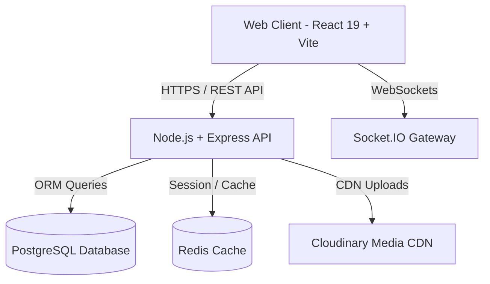

# Madhur System Architecture Overview

Madhur is designed as a feature-first, scalable monorepo.

## 🏗 High Level Architecture

## 📦 Core Workspace Packages

- `@madhur/ui`: Reusable design components powered by Tailwind v4.
- `@madhur/types`: Domain model interfaces and request DTOs.
- `@madhur/shared`: Cross-cutting validation schemas (Zod).
- `@madhur/constants`: Shared HTTP status, Socket event names.
- `@madhur/utils`: Formatting helpers and sanitization tools.
- `@madhur/config`: Standardized build, lint, and theme configs.
